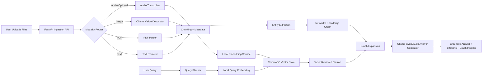

# Multi-Modal Graph RAG System

A production-oriented academic assignment that implements an end-to-end **Multi-Modal Retrieval Augmented Generation system with knowledge graph capabilities**. The platform ingests `text`, `pdf`, and `image` files by default, stores chunk embeddings in `ChromaDB`, models relationships in `NetworkX`, and answers user questions through grounded retrieval plus local Ollama-backed generation.

## What This Project Does

This system lets a user:

- upload documents across multiple modalities
- convert each modality into retrieval-ready text
- store semantic chunks in a vector database
- connect related chunks and entities through a knowledge graph
- ask grounded questions over the uploaded knowledge base
- inspect retrieved evidence, graph insights, and generated answers in a polished frontend

The current implementation uses:

- `qwen2:0.5b` on local Ollama for final answer generation
- `moondream` on local Ollama for image understanding
- deterministic local embeddings for stable retrieval without API quota dependency

## Key Features

- Multi-modal ingestion pipeline for text documents, PDFs, and images, with optional audio hooks.
- Vector retrieval using `ChromaDB` with persistent local storage.
- Knowledge graph construction using `NetworkX` for document, chunk, entity, and cross-modal relationships.
- FastAPI backend exposing ingestion, querying, graph summary, inventory listing, and file deletion APIs.
- React + Vite frontend with a presentation-ready dashboard, upload workspace, query console, and evidence panels.
- File inventory management with per-file removal from the UI.
- Dockerized deployment with a single `docker-compose.yml`.
- Local Ollama integration using your host Ollama server.
- Graceful fallback behavior if cloud APIs are unavailable or disabled.

## Evaluation Mapping

This implementation is intentionally aligned with the assignment rubric:

- `System Design & Architecture`
  - clear backend/frontend separation
  - explicit ingestion, retrieval, graph, and generation stages
- `Multi-Modal Implementation`
  - working ingestion for text, PDF, and image modalities
  - image understanding handled through a local vision model
- `Functionality & Demo`
  - interactive upload, query, retrieval, graph insights, and file removal flow
- `Dockerization & Deployment`
  - single `docker-compose.yml` entry point
- `Code Quality & GitHub Usage`
  - modular backend services and documented branching strategy
- `Literature Survey`
  - included in this README and tied back to design choices
- `Presentation Quality`
  - architecture diagram, demo script, and polished UI included

## Architecture Diagram



The editable Mermaid source is available in [docs/architecture.mmd](docs/architecture.mmd).

## Tech Stack

- Frontend: React, Vite, TypeScript, custom CSS
- Backend: FastAPI, Python 3.11
- Embeddings: deterministic local hash embeddings by default, OpenAI embeddings only if explicitly configured
- Vector Database: ChromaDB
- Knowledge Graph: NetworkX
- Answer Model: Ollama `qwen2:0.5b`
- Vision Model: Ollama `moondream`
- Parsing: `PyPDF2`, `Pillow`
- Deployment: Docker, Docker Compose, Nginx

## Project Structure

```text
.
- backend
  - app
    - api
    - services
    - utils
    - main.py
  - data
  - Dockerfile
  - requirements.txt
- frontend
  - src
  - Dockerfile
  - nginx.conf
  - package.json
- docs
  - architecture.mmd
  - demo-script.md
- docker-compose.yml
- .env.example
- README.md
```

## Supported Modalities

### 1. Text

- Extensions: `.txt`, `.md`, `.csv`, `.json`, `.html`
- Flow: read -> normalize -> chunk -> embed -> index

### 2. PDF

- Extension: `.pdf`
- Flow: extract page text with `PyPDF2` -> chunk -> embed -> index

### 3. Image

- Extensions: `.png`, `.jpg`, `.jpeg`, `.bmp`, `.gif`, `.webp`
- Flow:
  - with `LLM_PROVIDER=ollama` and `OLLAMA_VISION_MODEL=moondream`: generate local image description for retrieval
  - with `LLM_PROVIDER=openai`: generate cloud image description
  - without a vision-capable model: fall back to metadata-based summary

### Optional 4. Audio

- Extensions: `.mp3`, `.wav`, `.m4a`, `.ogg`, `.flac`
- Flow:
  - with `LLM_PROVIDER=openai` and valid API access: Whisper transcription
  - otherwise: filename-level placeholder metadata

## Query Pipeline

1. Query processing rewrites the question, extracts keywords, and infers modality filters.
2. Query embeddings are generated locally using the same embedding logic used at ingestion time.
3. ChromaDB returns top-k relevant chunks.
4. NetworkX expands each hit with graph-neighbor insights such as related entities and cross-modal links.
5. Ollama `qwen2:0.5b` generates the final answer from grounded retrieved context.
6. If an external model path fails, the backend falls back to a deterministic extractive answer mode instead of crashing.

## Knowledge Graph Design

The graph contains:

- `document` nodes for uploaded assets
- `chunk` nodes for retrieval units
- `entity` nodes extracted from content

Relationships include:

- `HAS_CHUNK`
- `MENTIONS`
- `CONTAINS_ENTITY`
- `CROSS_MODAL_LINK`

This gives the project a genuine graph-RAG behavior rather than plain vector search.

## API Endpoints

- `GET /api/health` - service health
- `GET /api/documents` - list indexed files
- `DELETE /api/documents/{document_id}` - remove one indexed file from inventory, vectors, graph, and uploads
- `GET /api/graph` - graph summary for the frontend
- `POST /api/ingest` - upload and index one or more files
- `POST /api/query` - run a grounded multi-modal RAG query

## Frontend Experience

The frontend is designed for demo clarity and grading:

- branded dashboard header with live status cues
- upload panel with selected-file previews
- inventory cards with delete actions
- graph analytics section with modality distribution
- guided query workspace with quick prompt suggestions
- structured answer panel with citations, graph insights, and retrieved evidence

## Expected Outputs

When the system is working correctly, the evaluator should observe:

- after file upload:
  - inventory cards appear immediately
  - modality labels are correct
  - graph node and edge counts increase
- after a query:
  - an answer is generated in the response panel
  - citations appear for retrieved sources
  - graph insights appear when relationships exist
  - evidence cards show top retrieved chunks
- after deleting a file:
  - the inventory card disappears
  - graph counts update
  - subsequent answers no longer use the removed file

## How To Run

### Option 1: Docker Compose

1. Copy `.env.example` to `.env`.
2. Start Ollama on your machine.
3. Make sure these models exist locally:

```powershell
ollama list
```

You should see:

- `qwen2:0.5b`
- `moondream`

If `moondream` is missing:

```powershell
ollama pull moondream
```

4. Ensure `.env` contains:

```env
LLM_PROVIDER=ollama
OLLAMA_BASE_URL=http://host.docker.internal:11434
OLLAMA_MODEL=qwen2:0.5b
OLLAMA_VISION_MODEL=moondream
OLLAMA_TIMEOUT_SECONDS=120
```

5. Run:

```bash
docker compose up --build
```

6. Open:

- Frontend: `http://localhost:3000`
- Backend docs: `http://localhost:8000/docs`
- Host Ollama API: `http://localhost:11434`

### Quick Verifications Before Demo

Run these checks before presenting:

```powershell
ollama list
docker compose ps
docker compose logs --tail=50
```

You should confirm:

- `qwen2:0.5b` is available in Ollama
- `moondream` is available in Ollama
- backend and frontend containers are both up
- there are no repeated traceback errors in backend logs

### Option 2: Run Locally Without Docker

Backend:

```bash
cd backend
python -m venv .venv
.venv\Scripts\activate
pip install -r requirements.txt
uvicorn app.main:app --reload
```

Frontend:

```bash
cd frontend
npm install
npm run dev
```

## Recommended Test Flow

1. Upload one `.txt` file.
2. Upload one `.pdf`.
3. Upload one `.jpg` or `.png`.
4. Confirm:
   - inventory cards appear
   - graph metrics update
   - modality rows appear in the graph section
5. Ask:

```text
Summarize the uploaded knowledge base and mention what the image shows.
```

6. Verify:
   - answer is generated
   - citations appear
   - graph insights appear
   - evidence cards appear

7. Remove one file from inventory and confirm:
   - it disappears from the UI
   - graph counts update
   - it no longer contributes to future answers

## Suggested Sample Questions

Use questions like these during testing or presentation:

- `Summarize the uploaded knowledge base.`
- `What does the uploaded PDF explain?`
- `What does the uploaded image show?`
- `Compare the uploaded image with the uploaded text or PDF.`
- `What are the main entities mentioned across the uploaded files?`

## Demo Flow For Presentation

A ready demo outline is available in [docs/demo-script.md](docs/demo-script.md). Suggested flow:

1. Show the architecture diagram.
2. Explain the dual memory design: vector store + graph store.
3. Upload one file from each supported modality.
4. Highlight graph counts, modality breakdown, and inventory cards.
5. Run a cross-modal query.
6. Show retrieved evidence, graph insights, and grounded answer.
7. Demonstrate file deletion to show inventory management.

## Challenges Faced And Solutions

### Challenge 1: Different modalities do not naturally become searchable in the same way

Text and PDFs already contain text, but images do not. The solution was to normalize every modality into a text-centric intermediate representation before chunking and retrieval.

### Challenge 2: Graph-RAG can become too operationally heavy for a coursework demo

Neo4j would increase setup complexity. `NetworkX` was selected as a lightweight graph layer that still satisfies graph reasoning and explainability requirements.

### Challenge 3: API quota and internet dependence can break live demos

The project was shifted to local Ollama-based generation and local embeddings by default, so the demo remains stable even without cloud model access.

### Challenge 4: Demo usability matters, not just backend correctness

The frontend was refined to include better hierarchy, evidence presentation, and inventory controls so the app is easier to present within a 10-minute academic demo.

## Known Limitations

- Image understanding quality depends on the capability of the local vision model and may be weaker than larger cloud multimodal models.
- Audio support remains optional and is stronger with a cloud transcription provider.
- Local deterministic embeddings are stable and demo-friendly, but they are less semantically rich than strong cloud embedding models.
- This project prioritizes reliability and academic presentation value over enterprise-scale optimization.

## Literature Survey

This project references the paper **"A Survey on Large Language Model based Autonomous Agents"** by Lei Wang, Chen Ma, Xueyang Feng, Zeyu Zhang, Hao Yang, Jingsen Zhang, Zhiyuan Chen, Jiakai Tang, Xu Chen, Yankai Lin, Wayne Xin Zhao, Zhewei Wei, and Ji-Rong Wen, published in *Frontiers of Computer Science* in 2024.

Source:

- Springer article: https://link.springer.com/article/10.1007/s11704-024-40231-1

Summary:

- The paper organizes LLM-based autonomous agents into modules such as profiling, memory, planning, and action.
- It argues that strong agent behavior comes from orchestration around the model, not only the model itself.
- That directly influenced this project: ChromaDB acts as retrieval memory, the knowledge graph adds structured relational memory, and the query planner orchestrates retrieval before answer generation.
- The survey also highlights robustness, grounding, and evaluation as central concerns, which is why this project surfaces citations, graph insights, and evidence-backed responses.

## GitHub And Branching Strategy

Recommended branching model when publishing:

- `main` for stable demo-ready code
- `dev` for integration
- `feature/ingestion-pipeline`
- `feature/ollama-integration`
- `feature/frontend-polish`
- `feature/inventory-management`

Suggested workflow:

1. Create feature branches from `dev`.
2. Make focused commits with descriptive messages.
3. Open Pull Requests into `dev`.
4. Merge `dev` into `main` once the demo build is stable.

Example commit messages:

- `feat(backend): add multimodal ingestion and chroma indexing`
- `feat(llm): switch answer generation to local ollama models`
- `feat(frontend): redesign dashboard and evidence panels`
- `feat(inventory): add document deletion from ui and backend`
- `docs(readme): align setup and demo steps with ollama pipeline`

## Submission Checklist

- [x] Full-stack app with React frontend and FastAPI backend
- [x] Multi-modal ingestion for at least three modalities
- [x] Vector database retrieval
- [x] Knowledge graph construction
- [x] Local LLM-based answer generation
- [x] Dockerfiles and `docker-compose.yml`
- [x] `.env.example`
- [x] README with architecture, setup, challenges, and literature survey

## Notes

- The backend runtime targets Python 3.11, which matches the Dockerfile.
- Local Ollama must be running on the host machine for the Dockerized backend to reach `host.docker.internal:11434`.
- The repository is ready to be initialized or pushed to GitHub, but remote publishing must be done from an environment with git access configured.
- If a real OpenAI key was used during testing, rotate it before publishing the repository.
