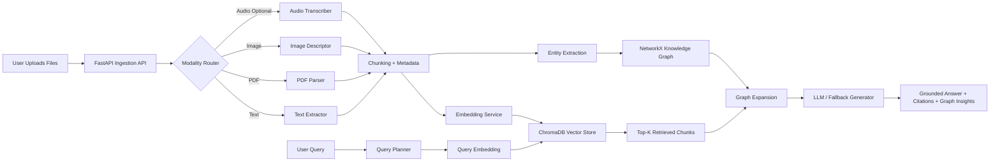

# Multi-Modal Graph RAG System

A production-oriented, full-stack academic assignment that implements an end-to-end Multi-Modal Retrieval Augmented Generation system with a lightweight knowledge graph. The platform ingests `text`, `pdf`, and `image` files by default, stores chunk embeddings in `ChromaDB`, models relationships in `NetworkX`, and answers user questions through grounded retrieval plus local Ollama-backed or fallback generation.

## Key Features

- Multi-modal ingestion pipeline for text documents, PDFs, and images, with optional audio transcription hooks.
- Vector retrieval using `ChromaDB` with persistent storage.
- Knowledge graph construction using `NetworkX` for document, chunk, entity, and cross-modal relationships.
- FastAPI backend exposing ingestion, listing, graph-summary, and query endpoints.
- React + Vite frontend for uploads, chat-style querying, and evidence inspection.
- Dockerized deployment with a single `docker-compose.yml`.
- Local Ollama integration using your host Ollama server with `qwen2:0.5b` for answer generation and `moondream` for image understanding.
- Graceful offline fallback mode when no API key is configured, useful for demos and evaluation.

## Architecture Diagram



The editable Mermaid source is also available in [docs/architecture.mmd](docs/architecture.mmd).

## Tech Stack

- Frontend: React, Vite, TypeScript, custom CSS
- Backend: FastAPI, Python 3.11
- Embeddings: deterministic local hash embeddings by default, OpenAI embeddings when explicitly configured
- Vector DB: ChromaDB
- Knowledge Graph: NetworkX
- LLM: Ollama (`qwen2:0.5b`) by default, with `moondream` for image understanding; OpenAI optionally; extractive fallback answer synthesis otherwise
- Document Parsing: `PyPDF2`, `Pillow`
- Deployment: Docker, Docker Compose, Nginx

## Project Structure

```text
.
├── backend
│   ├── app
│   │   ├── api
│   │   ├── services
│   │   ├── utils
│   │   └── main.py
│   ├── data
│   ├── Dockerfile
│   └── requirements.txt
├── frontend
│   ├── src
│   ├── Dockerfile
│   ├── nginx.conf
│   └── package.json
├── docs
│   ├── architecture.mmd
│   └── demo-script.md
├── docker-compose.yml
├── .env.example
└── README.md
```

## Modalities Supported

### 1. Text

- Supported extensions: `.txt`, `.md`, `.csv`, `.json`, `.html`
- Processing: read, normalize, chunk, embed, and index

### 2. PDF

- Supported extension: `.pdf`
- Processing: extract page text via `PyPDF2`, then chunk, embed, and index

### 3. Image

- Supported extensions: `.png`, `.jpg`, `.jpeg`, `.bmp`, `.gif`, `.webp`
- Processing:
- With `LLM_PROVIDER=ollama` and `OLLAMA_VISION_MODEL=moondream`: generates a local vision description for better retrieval
- With `OPENAI_API_KEY` and `LLM_PROVIDER=openai`: generates a cloud vision description
- Without a vision-capable model: falls back to metadata-driven indexing using filename and dimensions

### Optional 4. Audio

- Supported extensions: `.mp3`, `.wav`, `.m4a`, `.ogg`, `.flac`
- Processing:
- With `OPENAI_API_KEY` and `LLM_PROVIDER=openai`: transcribes via Whisper
  - Without API key: stores filename-level placeholder metadata

## Query Pipeline

1. Query processing rewrites the question, extracts keywords, and infers modality filters.
2. Query embeddings are generated using the same embedding service as ingestion.
3. ChromaDB returns top-k relevant chunks.
4. NetworkX expands each hit with graph-neighbor insights such as related entities and cross-modal links.
5. The final answer is generated from retrieved context using Ollama by default, OpenAI if explicitly configured, or a grounded fallback summarizer otherwise.

## Knowledge Graph Design

The graph contains:

- `document` nodes for each uploaded asset
- `chunk` nodes for each retrieval unit
- `entity` nodes extracted from content

Edges include:

- `HAS_CHUNK`
- `MENTIONS`
- `CONTAINS_ENTITY`
- `CROSS_MODAL_LINK`

This graph makes the system more explainable than plain vector search by surfacing entity and modality relationships during retrieval.

## API Endpoints

- `GET /api/health` - service health
- `GET /api/documents` - list indexed files
- `GET /api/graph` - graph summary for the UI
- `POST /api/ingest` - upload and index one or more files
- `POST /api/query` - run a grounded multi-modal RAG query

## How To Run

### Option 1: Docker Compose

1. Copy `.env.example` to `.env`.
2. Start Ollama on your machine and confirm `qwen2:0.5b` and `moondream` are available locally.
3. Set `OLLAMA_BASE_URL=http://host.docker.internal:11434` in `.env`.
4. Optionally add `OPENAI_API_KEY` and set `LLM_PROVIDER=openai` if you want cloud generation, image understanding, and audio transcription.
5. Run:

```bash
docker-compose up --build
```

6. Open:

- Frontend: `http://localhost:3000`
- Backend docs: `http://localhost:8000/docs`
- Host Ollama API: `http://localhost:11434`

### Option 2: Run Locally Without Docker

Backend:

```bash
cd backend
python -m venv .venv
.venv\Scripts\activate
pip install -r requirements.txt
uvicorn app.main:app --reload
```

Frontend:

```bash
cd frontend
npm install
npm run dev
```

## Demo Flow For Presentation

A 10-minute demo script is included in [docs/demo-script.md](docs/demo-script.md). The recommended flow is:

1. Show the architecture diagram and explain the two persistence layers: vector store and graph store.
2. Upload one text file, one PDF, and one image.
3. Refresh the UI and point out modality counts, node/edge counts, and extracted entities.
4. Ask a cross-modal question and show retrieved evidence cards plus graph insights.
5. Explain how grounded generation reduces hallucination compared with direct prompting.

## Challenges Faced And Solutions

### Challenge 1: Heterogeneous modalities create uneven text representations

Images and audio do not naturally become retrieval-ready text. The solution was to normalize every modality into a text-centric intermediate representation before chunking and embedding. That keeps the downstream vector retrieval simple and consistent.

### Challenge 2: Graph RAG can become over-engineered for a coursework demo

Using Neo4j would add another container and operational complexity. The solution was to use `NetworkX`, which still satisfies graph reasoning requirements while keeping `docker-compose up` simple and reliable.

### Challenge 3: Dependence on external APIs can hurt demo stability

Academic demos fail when network keys or quotas are unavailable. This project uses local Ollama generation by default and also includes deterministic local embedding and answer-generation fallbacks so the system remains demonstrable even without external model credentials.

## Literature Survey

This project references the paper **"A Survey on Large Language Model based Autonomous Agents"** by Lei Wang, Chen Ma, Xueyang Feng, Zeyu Zhang, Hao Yang, Jingsen Zhang, Zhiyuan Chen, Jiakai Tang, Xu Chen, Yankai Lin, Wayne Xin Zhao, Zhewei Wei, and Ji-Rong Wen. It was published in *Frontiers of Computer Science* in 2024.

Source:

- Springer article: https://link.springer.com/article/10.1007/s11704-024-40231-1

Summary:

- The paper organizes LLM-based autonomous agents into a common framework with modules for profiling, memory, planning, and action.
- It argues that strong agent behavior comes not only from the model itself, but from how external memory, tools, and control loops are orchestrated around it.
- That idea directly influenced this assignment architecture: the vector database acts as long-term retrieval memory, the knowledge graph adds structured relational memory, and the query planner orchestrates retrieval before generation.
- The survey also highlights evaluation challenges such as robustness, grounding, and reliable long-horizon reasoning. Those concerns motivated the inclusion of citations, graph insights, and fallback behavior in this implementation.

## GitHub And Branching Strategy

Use the following branching model when publishing the project:

- `main` for stable, demo-ready code
- `dev` for integration testing
- `feature/ingestion-pipeline`, `feature/query-ui`, `feature/dockerization`, etc. for focused work

Recommended workflow:

1. Create feature branches from `dev`.
2. Make small commits with descriptive messages.
3. Open Pull Requests into `dev`.
4. Merge `dev` into `main` once the demo build is stable.

Example commit messages:

- `feat(backend): add multimodal ingestion and chroma indexing`
- `feat(graph): build cross-modal knowledge graph relationships`
- `feat(frontend): add upload dashboard and evidence viewer`
- `chore(deploy): dockerize frontend and backend with compose`
- `docs(readme): add architecture diagram and literature survey`

## Submission Checklist

- [x] Full-stack app with React frontend and FastAPI backend
- [x] Multi-modal ingestion for at least three modalities
- [x] Vector database retrieval
- [x] Knowledge graph construction
- [x] LLM-based answer generation with fallback mode
- [x] Dockerfiles and `docker-compose.yml`
- [x] `.env.example`
- [x] README with architecture, setup, challenges, and literature survey

## Notes

- Docker was not available in the current build environment while this code was authored, so `docker-compose up` could not be executed here for runtime verification.
- The backend dependency set targets Python 3.11, which matches the provided Dockerfile. Local validation on Python 3.13 was limited because `chromadb==0.5.5` is not available for that interpreter.
- The repository is ready to be initialized or pushed to a public GitHub repository, but publishing to GitHub must be done from an environment with git remote access configured.
